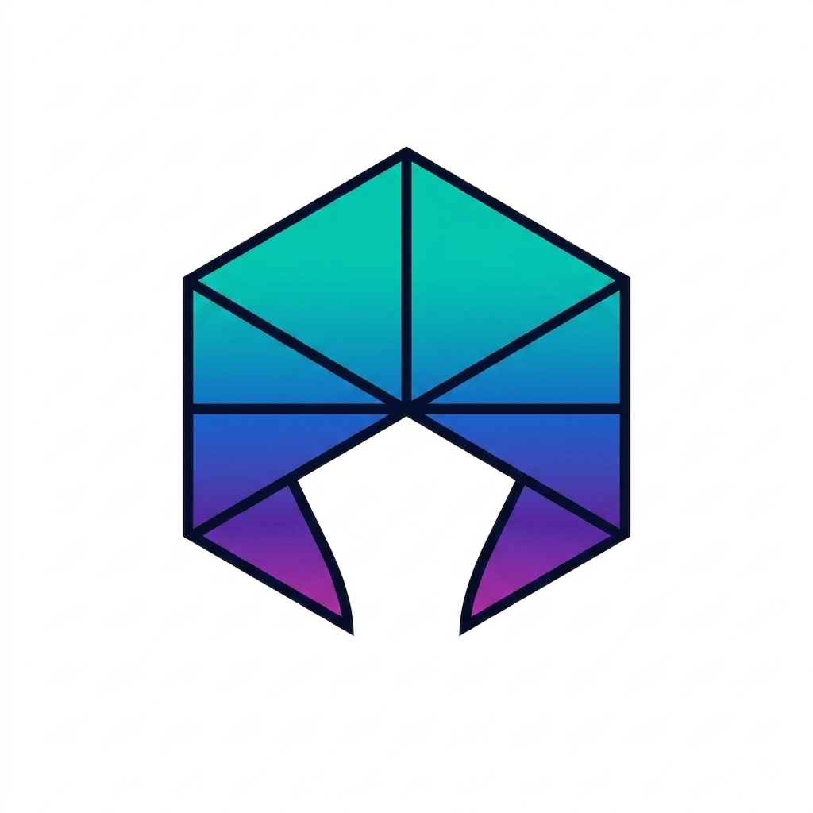

🐧 EZOS

EZOS is a standalone Linux distribution built from scratch to run on Android through Termux + "proot-distro".

Built on top of Debian "bookworm-slim", EZOS comes with its own branding, a custom package manager ("ezpkg"), and a collection of exclusive tools designed specifically for EZOS. 🚀

✨ Features

- 🐧 Base: Debian "bookworm-slim"
- 📦 Custom Package Manager: "ezpkg"
- 🛠️ Exclusive Tools: "ezinfo", "ezupdate", and more coming soon
- 🎨 Full Branding: Custom ASCII logo, MOTD, and "/etc/os-release"
- 📦 OCI Image: Distributed through GitHub Container Registry (GHCR)
- 📱 Android Ready: Designed to run directly on Android using Termux

📥 Installation

Requirements

Make sure you have Termux with "proot-distro" installed.

🚀 Install EZOS
```text
pkg update -y
pkg install proot-distro -y
proot-distro install ghcr.io/mrzgamingv20-cyber/ezos:latest
```
🔑 Login to EZOS
```text
proot-distro login ezos
```
That's it! 🎉 You are now inside EZOS.

📦 Package Repository

Additional packages for "ezpkg" are stored in the ""packages/"" (./packages) directory.

The available packages are registered in ""index.json"" (./packages/index.json).

packages/
├── ...
└── index.json

👨‍💻 Contributors

- idk ("@mrzgamingv20-cyber" (https://github.com/mrzgamingv20-cyber))
  Creator & developer of EZOS 🧑‍💻

- Claude (Anthropic) 🤖
  Technical assistant during development

- Me: 10% 😎
  Mostly responsible for making the logo :v

- Claude: 90% 🗿

📜 License

EZOS is a personal/fun project.

Feel free to:

- 🔧 Use it
- ✏️ Modify it
- 🚀 Build your own project on top of it
- 💡 Experiment with it

Do whatever you want with it — if anyone actually wants to use it :v

---

<p align="center">
  Made with 🐧, ☕, and a questionable amount of code.
