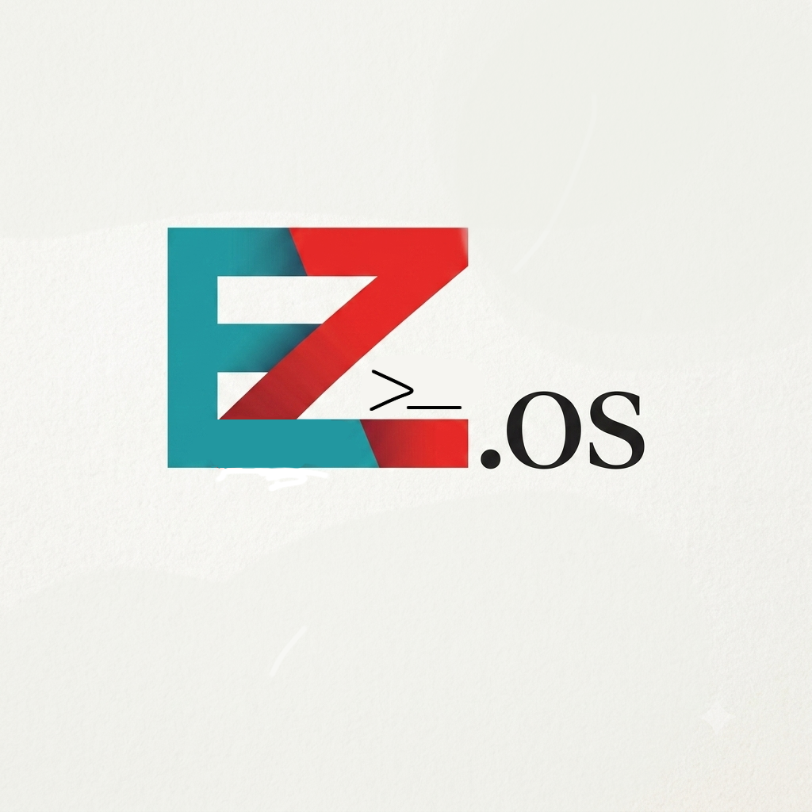

# EZOS

**EZOS** adalah distro Linux mandiri (standalone) yang dibangun dari nol untuk dijalankan di Android lewat Termux + `proot-distro`. Berbasis Debian (`bookworm-slim`), EZOS dilengkapi branding sendiri, package manager custom (`ezpkg`), dan beberapa tools eksklusif yang gak ada di distro lain.

## Fitur
- Base: Debian bookworm-slim
- Package manager sendiri: `ezpkg` (install/remove/search/update/upgrade/list)
- Tools eksklusif: `ezinfo`, `ezupdate`, dan lainnya menyusul
- Branding penuh: logo ASCII custom, MOTD, `/etc/os-release`
- Didistribusikan sebagai OCI image lewat GitHub Container Registry (GHCR)

## Cara Install

Butuh Termux dengan `proot-distro` terinstall:

'pkg update -y
pkg install proot-distro -y
proot-distro install ghcr.io/mrzgamingv20-cyber/ezos:latest
proot-distro login ezos'

Setelah masuk, semua tools EZOS termasuk \`ezpkg\` udah siap dipakai:
\`\`\`bash
ezpkg install htop
ezinfo
\`\`\`

## Repo Paket

Paket-paket tambahan buat \`ezpkg\` disimpan di folder [\`packages/\`](./packages) repo ini, terdaftar di [\`index.json\`](./packages/index.json).

## Kontributor

- **idk** ([@mrzgamingv20-cyber](https://github.com/mrzgamingv20-cyber)) — pembuat & pengembang EZOS
- Dibangun dengan bantuan Claude (Anthropic) sebagai asisten teknis selama development
- aku 10% (cuma bikin logo doang :v)
- claude 90% 

## Lisensi

Proyek personal/iseng — bebas dipakai, dimodifikasi, atau dijadiin basis buat proyek lain itu pun jika ada yg mau :v
